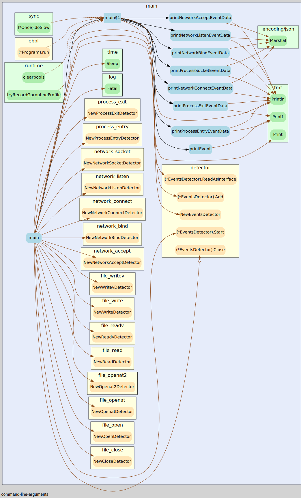

# Call Graph

To visuialize call graph in interactive mode. Follow the below steps.

Step 1:
    Follow the steps to install go-callvis [click here](https://github.com/ondrajz/go-callvis#installation).

step 2: 
    Clone this Project.

step 3: 
    Run the following command to interact with call graph
```sh
    go-callvis -algo=rta -graphviz -nodeshape=plaintext ./cmd/dev-cli/main.go
```

