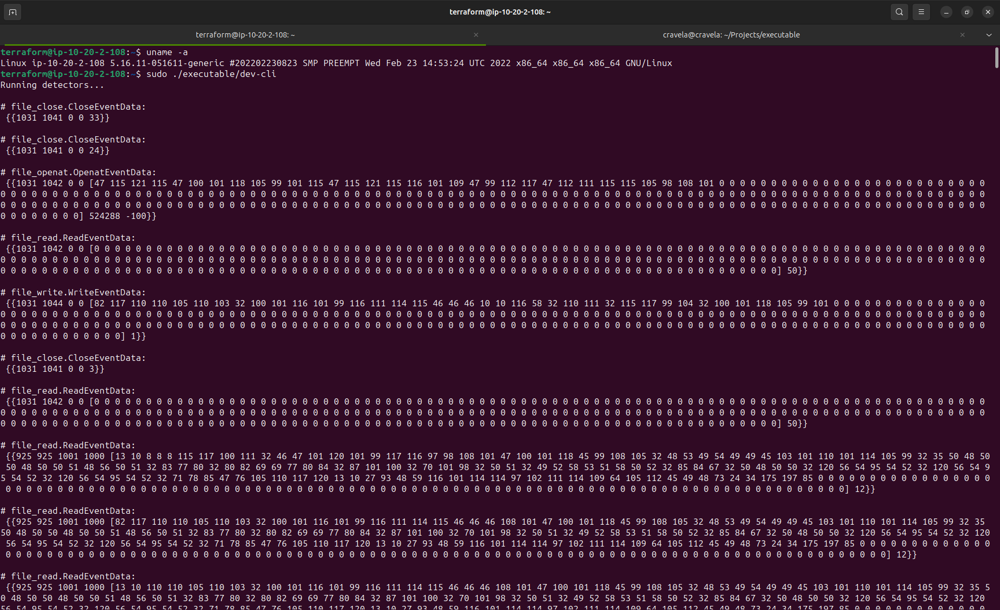

# Compatibility and Testing Overview

## Current Compatibility

Our project is currently compatible with kernel versions 5.8.0 to 6.12.0 (inclusive). We have verified its functionality on Ubuntu machines with kernel versions >=5.0.0, and have found no issues on kernel versions >= 5.8.0.

## Compatibility Testing Strategy

Given the critical nature of our product, we have a comprehensive testing strategy to ensure its compatibility and performance across different kernels and Linux distributions:

- **Kernel Compatibility**: We test our product across different kernel versions to ensure optimal performance.
- **Distribution Compatibility**: We verify our product's compatibility across multiple Linux distributions.

## Evidence of Compatibility

We have conducted compatibility tests on the following kernel versions:

- Kernel version 5.8.0
  

- Kernel version 5.9.0
  

- Kernel version 5.12.0
  

- Kernel version 5.16.11
  

- Kernel version 5.19.0
  

## Testing Methodology

Our testing methodology ensures the stability and compatibility of our project:

1. **Local Development Environment**: We build the project locally.
2. **Virtual Machine Testing**: We export the generated executable to a virtual machine.
3. **Kernel Version Testing**: We boot the virtual machine with the desired kernel version.
4. **Execution Testing**: We execute the project's executable on the virtual machine.
5. **Unit Testing**: We have incorporated unit testing to verify the correctness of individual units of source code.

## Future Testing Plans

We are committed to expanding our testing scope and improving compatibility:

- **Extended Kernel Testing**: We plan to test our code on more kernel versions and different Ubuntu flavors.
- **Detailed Output Information**: We aim to provide more detailed output information for a wider range of environments.
- **Enhanced Unit Testing**: We plan to enhance our unit testing suite to cover more components of our project.

We encourage the community to report any issues they encounter on different setups. This feedback will help us enhance the overall compatibility and robustness of our project.
